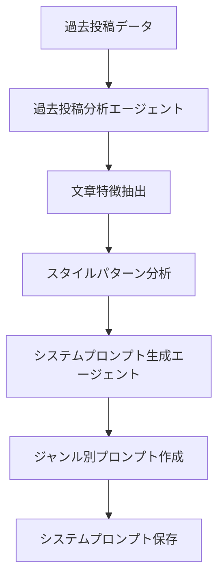
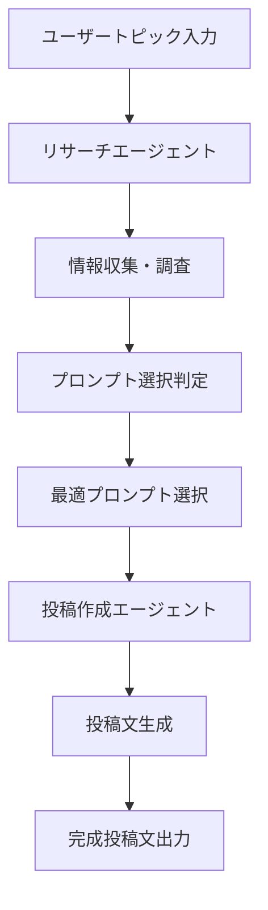

# CLAUDE.md - X 投稿マルチエージェントシステム

このプロジェクトは Claude Code Sub Agent を使用して X（Twitter）投稿文章を作成するマルチエージェントシステムです。

## 🎯 プロジェクト概要

4 つの専門エージェントが連携して、ユーザーのトピックから高品質な X 投稿文を自動生成するシステムです。各エージェントがそれぞれの専門領域を担当し、最終的に効果的な投稿文を作成します。

## 🤖 エージェント構成

### 1. リサーチエージェント (x-research-agent)

- **役割**: トピック・キーワードに基づく情報収集
- **入力**: ユーザーのトピック、キーワード、要求仕様
- **出力**: 調査結果、関連情報、トレンドデータ
- **機能**: Web 検索、トレンド分析、情報フィルタリング
- **呼び出し方法**: Task ツールで `subagent_type: "x-research-agent"` を指定
- **使用例**: トレンドトピック調査、競合分析、関連情報収集

### 2. 過去投稿分析エージェント (x-post-analyzer)

- **役割**: 過去投稿の分析とパターン抽出
- **入力**: 過去投稿ディレクトリ、投稿ジャンル
- **出力**: 投稿スタイル分析、文章特徴、構造パターン
- **分析項目**:
  - 文章の癖・特徴
  - 語彙選択パターン
  - 文末表現の傾向
  - 投稿構造（フック、概要解説、深掘り、CTA）
  - バイラル要素の特定
- **呼び出し方法**: Task ツールで `subagent_type: "x-post-analyzer"` を指定
- **使用例**: 過去投稿の傾向分析、スタイル抽出、改善点特定

### 3. システムプロンプト生成エージェント (x-system-prompt-generator)

- **役割**: ジャンル別システムプロンプトの作成・管理
- **入力**: 投稿ジャンル、分析結果、スタイル要件
- **出力**: カスタマイズされたシステムプロンプト
- **特徴**: ジャンル別管理、動的生成、効果測定連携
- **呼び出し方法**: Task ツールで `subagent_type: "x-system-prompt-generator"` を指定
- **使用例**: ジャンル別プロンプト作成、スタイル別テンプレート生成

### 4. 投稿作成エージェント (x-post-creator)

- **役割**: 最終的な X 投稿文の生成
- **入力**: リサーチ結果、システムプロンプト、ユーザー要求
- **出力**: 完成投稿文、代替案、投稿メタデータ
- **呼び出し方法**: Task ツールで `subagent_type: "x-post-creator"` を指定
- **使用例**: 投稿文生成、バリエーション作成、ハッシュタグ提案

## 🗂️ ディレクトリ構造

```
x-agent/
├── .claude/                    # Claude Code エージェント設定
│   └── agents/                # エージェント定義ファイル
│       ├── x-research-agent.md
│       ├── x-post-analyzer.md
│       ├── x-system-prompt-generator.md
│       └── x-post-creator.md
├── agents/                     # 各エージェントの実装（オプション）
│   ├── research_agent.py      # リサーチエージェント
│   ├── analysis_agent.py      # 分析エージェント
│   ├── system_prompt_agent.py # システムプロンプトエージェント
│   └── post_creation_agent.py # 投稿作成エージェント
├── data/
│   ├── past_posts/            # 過去投稿（1ファイル1投稿）
│   ├── system_prompts/        # ジャンル別システムプロンプト
│   ├── research/              # リサーチ結果保存
│   └── analysis/              # 分析結果保存
│       ├── patterns/          # 抽出されたパターン
│       ├── styles/            # スタイル分析結果
│       └── metrics/           # パフォーマンス指標
├── tests/                      # テストファイル
├── config/                     # 設定ファイル
├── utils/                      # 共通ユーティリティ
└── docs/                       # ドキュメント・設計書
```

## 🔄 ワークフロー

### 📝 フロー1: 文章分析・システムプロンプト生成フロー



**フロー1詳細**:
1. **過去投稿読み込み**: 保存済み投稿データの取得
2. **文章分析実行**: 文体・構造・語彙パターンの抽出
3. **特徴パターン化**: 再利用可能な形式への変換
4. **プロンプト生成**: ジャンル別システムプロンプトの作成
5. **保存・管理**: 生成されたプロンプトの永続化

### 🚀 フロー2: 投稿作成フロー



**フロー2詳細**:
1. **トピック受付**: ユーザーからのトピック・要件入力
2. **リサーチ実行**: トレンド・関連情報の収集
3. **コンテキスト分析**: トピックに最適なプロンプト判定
4. **プロンプト選択**: 保存済みプロンプトから最適なものを選択
5. **投稿生成**: リサーチ結果とプロンプトを統合して作成
6. **結果出力**: 完成投稿文と代替案の提示

## 🛠️ 技術仕様

### 依存関係

- `openai`: Claude API 連携
- `requests`: Web API 呼び出し
- `pyyaml`: 設定ファイル管理
- `pytest`: テスト実行
- `rich`: CLI 美化
- `typer`: CLI 作成

### データフォーマット

- **過去投稿**: `.txt`形式（1 ファイル 1 投稿）
- **システムプロンプト**: `.yaml`形式（ジャンル別管理）
- **リサーチデータ**: `.json`形式

## 🧪 品質保証

### テスト戦略

- 各エージェントの単体テスト
- エージェント間連携の統合テスト
- 実際の投稿効果測定
- Playwright MCP による localhost 検証

### エラーハンドリング

- 詳細なログ記録システム
- エラー分類・通知機能
- 自動リトライ機能

## 📋 実装フェーズ

1. **Phase 1**: 基本フレームワーク構築
2. **Phase 2**: リサーチエージェント実装
3. **Phase 3**: 分析エージェント実装
4. **Phase 4**: システムプロンプトエージェント実装
5. **Phase 5**: 投稿作成エージェント実装
6. **Phase 6**: 統合テスト・調整

## 📈 期待効果

- **品質向上**: 分析に基づく最適化された投稿文
- **効率化**: 手動作成から自動生成への移行
- **一貫性**: ジャンル別スタイル管理
- **学習能力**: フィードバックによる継続改善

## 🚀 エージェントの使用方法

### 基本的な使い方

1. **単独エージェントの実行**
```bash
# リサーチエージェントでトピック調査
# Claude Code 内で Task ツールを使用
Task(subagent_type="x-research-agent", prompt="AI エージェントの最新トレンドを調査")
```

2. **エージェント連携フロー**
```bash
# Step 1: 過去投稿を分析
Task(subagent_type="x-post-analyzer", prompt="data/past_posts/ の投稿を分析")

# Step 2: システムプロンプト生成
Task(subagent_type="x-system-prompt-generator", prompt="分析結果からテクノロジージャンルのプロンプトを生成")

# Step 3: リサーチ実行
Task(subagent_type="x-research-agent", prompt="生成AI の最新動向を調査")

# Step 4: 投稿作成
Task(subagent_type="x-post-creator", prompt="リサーチ結果とシステムプロンプトから投稿を作成")
```

### エージェント間のデータ受け渡し

- **分析結果**: `data/analysis/` ディレクトリに自動保存
- **リサーチ結果**: `data/research/` ディレクトリに JSON 形式で保存
- **システムプロンプト**: `data/system_prompts/` にジャンル別で管理
- **生成投稿**: 標準出力または指定ファイルに出力

### 推奨ワークフロー

1. **初期セットアップ**
   - 過去投稿を `data/past_posts/` に配置
   - x-post-analyzer で分析実行
   - x-system-prompt-generator でプロンプト生成

2. **日常の投稿作成**
   - x-research-agent でトピック調査
   - x-post-creator で投稿生成
   - 必要に応じてバリエーション作成

3. **継続的改善**
   - 新しい投稿を past_posts に追加
   - 定期的に分析を再実行
   - システムプロンプトを更新
